# A Broad Overview

EverAfter is a reactivity library that glues together reactive inputs with a notion of reactive outputs.

This book primarily describes everafter's reactivity philosophy, using the library to illustrate the concepts.

# Characteristics

EverAfter reactivity is a flavor of discrete incremental computation with these novel properties:

1. strong from-scratch consistency
2. execution-driven
3. revision tracking

## Incremental Computation

EverAfter reactivity is a flavor of [incremental computation][incremental], as described by [Umut Acar][acar] in [Self Adjusting Computation][acar-diss] and more recently in a number of papers by [Matt Hammer][hammer].

[incremental]: https://en.wikipedia.org/wiki/Incremental_computing
[acar-diss]: https://www.cs.cmu.edu/~rwh/theses/acar.pdf
[acar]: http://www.umut-acar.org/
[hammer]: https://dblp.uni-trier.de/pers/h/Hammer:Matthew_A=.html

Incremental computation is described by Hammer:

> In many software systems, a fixed algorithm runs repeatedly over a series of _incrementally changing_ inputs (<math><msub><mi>Input</mi><mn>1</mn></msub><mo>,</mo><mspace/><msub><mi>Input</mi><mn>2</mn></msub><mo>,</mo><mspace/><mi>&#x2026;</mi></math>), producing a series of _incrementally changing_ outputs (<math><msub><mi>Output</mi><mn>1</mn></msub><mo>,</mo><mspace/><msub><mi>Output</mi><mn>2</mn></msub><mo>,</mo><mspace/><mi>&#x2026;</mi></math>). For example, programmers often change only a single line of source code and recompile, so <math><msub><mi>Input</mi><mn>t</mn></msub></math> is often similar to <math><msub><mi>Input</mi><mn>t-1</mn></msub></math>.
>
> The goal of incremental _computation_ is to exploit input similarity by reusing work from previous runs. If the source code <math><msub><mi>Input</mi><mn>t</mn></msub></math> is almost the same as <math><msub><mi>Input</mi><mn>t-1</mn></msub></math>, much of the work done to compile <math><msub><mi>Input</mi><mn>t</mn></msub></math> and produce the target <math><msub><mi>Output</mi><mn>t</mn></msub></math> can be reused.

Hammer's incremental computation also defines a correctness property: "A program <math><mi>P</mi></math> is incremental if repeating <math><mi>P</mi></math> with a changed input is faster than from-scratch recomputation." This property is called <a name="from-scratch-consistency">from-scratch consistency</a>.

EverAfter reactivity is a flavor of incremental computation because it creates "from-scratch consistent" outputs more efficiently than from-scratch recomputation.

### Definitions

Throughout this book, we refer to _incrementally changing inputs_ as <a name="reactive-cell">reactive cells</a> (or <a name="cell">cells</a> for short).

We refer to _incrementally changing outputs_ as <a name="reactive-output">reactive outputs</a> (or <a name="output">outputs</a> for short).

We refer to the result of a computation on <a href="#reactive-value">reactive values</a> as <a name="derived value">derived values</a>.

Finally, we define <a name="reactive-value">reactive values</a> as either <a href="#reactive-cell">reactive cells</a> or <a href="#derived-value">derived values</a>.

### Strong _From-Scratch Consistency_

Normally, incremental computation is interested in improving the performance of maintaining from-scratch consistency; it is a pure optimization over from-scratch recomputation.

EverAfter reactivity is interested in another constraint: output data structures that have unmanaged internal state.

For example, consider an incremental program that turns some reactive inputs into a series of incrementally changing web pages, displayed in a web browser. Once the web page is displayed in the web browser, the user can interact with the web page, changing properties such as scroll position, cursor position, and focus.

Those properties are not present in the reactive inputs, so a from-scratch _recomputation_ would restore them to their initial state (as defined by web specifications).

For this reason, EverAfter reactivity uses a stronger definition of from-scratch consistency: "A program \\( P \\) is strongly from-scratch consistent if repeating \\( P \\) with a changed input is faster than from-scratch recomputation _and_ only if each atomic part of its output is only replaced when at least one of its reactive inputs changes."

We will explore the meaning of "atomic part" and the definition of a reactive input to an atomic part more fully throughout this book.

## Execution-Driven

EverAfter reactivity is _execution-driven_. This means that reactive inputs do not have references to the reactive outputs that depend upon them. Instead, reactive outputs determine whether they require recomputation by using a novel validation graph.

Consider this simple one-shot function written in TypeScript.

```ts
function program(input: string) {
  return document.createTextNode(input);
}
```

This program takes a single string input and returns a text node with the input string as its node value.

Many reactivity systems are push-based, propagating changes directly. This means that each reactive inputs holds a reference to its output, perhaps indirectly, and whenever the input changes, it notifies the output. Acar and Hammer describe this as applying a _change propagation algorithm_ to a _dynamic dependency graph_.


EverAfter's reactivity is _evaluation-based_. This means that values are always computed by dereferencing a variable or calling a function, both during initialization and change propagation.


After initializing the system, evaluation-based reactivity maintains the direction of data flow when propagating changes. Rather than propagating changes from inputs to outputs, evaluation-based data flow maintains the direction of data flow between initialization and updating. The primary benefit of this approach is significantly less up-front overhead that is normally incurred by bookkeeping. We will discuss other benefits of this approach throughout this book.

A careful reader has probably already noticed that evaluation-based data flow appears to have violated _from-scratch consistency_. We now perform the same number of expensive operations during change propagation as we did during initialization.

To restore from-scratch consistency, we add _revision tracking_ to our reactive system.

## Revision Tracking

First, we introduce a _revision clock_. Each tick of the global clock corresponds to a single mutation to a single reactive input.

Second, we associate each reactive input with a point on the <a name="revision-timeline">revision timeline</a> on which it was last mutated. We call this the input's <a name="timestamp">timestamp</a>. By storing the input's timestamp during initialization, a <a href="#reactive-output">reactive output</a> can efficiently determine whether it needs to demand the value and perform the expensive operation on the output.

<figure>


  <figcaption>Fig. 1. Change propagation</figcaption>
</figure>

<a name="everafter-reactivity">Evaluation-based reactivity with revision tracking ("EverAfter reactivity")</a> restores from-scratch consistency to our system. Provided that the input didn't change, change propagation is once again substantially cheaper than from-scratch evaluation.

Importantly, evaluation-based change propagation with revision tracking **does not** depend on a particular programming language's concept of referential equality, and it does not depend on memoizing input values. In practical use, the overhead of <a href="#timestamp">timestamp</a> validation is negligble.

The rest of this book is concerned with two topics:

1. Expanding the concepts we covered so far to allow for efficient validation of derived inputs
2. The practical implementation techniques that make EverAfter reactivity efficient in larger scale programs

## Composition at a Glance

Before moving on, we will describe, at a high level, how inputs can be composed together using <a href="#everafter-reactivity">EverAfter reactivity</a>, and how such a composition avoids adding overhead for each composition.

Consider the following from-scratch program.

<figure>

```ts
function fullName(first: string, last: string): string {
  return `${first} ${last}`;
}

function program(first: string, last: string, title: string) {
  let header = document.createElement("h1");
  let titleNode = document.createTextNode(title);
  header.appendChild(titleNode);

  let paragraph = document.createElement("p");
  let nameNode = document.createTextNode(fullName(first, last));
  paragraph.appendChild(lastNode);

  let div = document.createElement("div");
  div.appendChild(header);
  div.appendChild(paragraph);

  return div;
}
```

  <figcaption>Fig. 2. The code listing for a from-scratch program demonstrating composition</figcaption>
</figure>

This program expects three reactive variables (`first`, `last` and `title`). It derives `fullName` from `first` and `last`, which becomes the input to `nameNode`. As before, `title` is the input to `titleNode`.

<figure>


  <figcaption>Fig 3. A diagram of the data flow described by the code in Fig. 2</figcaption>
</figure>

When the user changes the inputs, the changes are propagated much the same way as in Fig. 1. Fig. 4 elaborates the consequences of composition.

```mermaid
sequenceDiagram
  participant User
  participant Inputs
  participant Output
  rect rgb(200, 200, 200)
  Note over User,Inputs: User initializes the inputs
  User->>Inputs: Initialize title to "hello world"
  User->>Inputs: Initialize first to "Matt"
  User->>Inputs: Initialize last to "Hammer"
  end
  rect rgb(220, 220, 220)
     Note over Inputs,Output: Initialize the system
     rect rgb(180, 180, 180)
        Note over Inputs,Output: Initialize header
        Output->>Inputs: What is the value of title?
        Inputs->>Output: "hello world"
        Output-->>Inputs: What is the timestamp of title?
        Inputs-->>Output: «1»
     end
     Note right of Output: Create text node
     Note right of Output: Last timestamp: «1»
     rect rgb(180, 180, 180)
        Note over Inputs,Output: Initialize paragraph
        rect rgb(160, 160, 160)
          rect rgba(160, 160, 160, 0.5)
            Output->>Inputs: What is the value of first?
            Inputs->>Output: "Matt"
            Output-->>Inputs: What is the timestamp of first?
            Inputs-->>Output: «1»
          end
          rect rgba(160, 160, 160, 0.5)
            Output->>Inputs: What is the value of last?
            Inputs->>Output: "Hammer"
            Output-->>Inputs: What is the timestamp of last?
            Inputs-->>Output: «1»
          end
        end
        Note left of Output: Invoke fullName with "Matt" and "Hammer"
        Note left of Output: Result: "Matt Hammer"
     end
     Note right of Output: Create text node
     Note right of Output: Last timestamp: «1»
  end
  Note over User,Output: Some time passes
  rect rgb(200, 200, 200)
    Note over User,Inputs: Update the inputs
    User->>Inputs: Update title to "goodbye world"
  end
  rect rgb(220, 220, 220)
    Note over Inputs,Output: Propagate changes
    Output-->>Inputs: Is title up to date for «1»?
    Inputs-->>Output: no
    Note right of Output: title is stale ⚠️
    Output->>Inputs: What is the value of title?
    Inputs->>Output: "goodbye world"
    Output-->>Inputs: What is the timestamp of first?
    Inputs-->>Output: «2»
    Note right of Output: Update title 🔨
    Note right of Output: Last timestamp: «2»
    Output-->>Inputs: Is first up to date for «1»?
    Inputs-->>Output: yes
    Output-->>Inputs: Is last up to date for «1»?
    Inputs-->>Output: yes
    Note right of Output: fullName is fresh ✔️
  end
  Note over User,Output: Some time passes
  rect rgb(200, 200, 200)
    Note over User,Inputs: Update the inputs
    User->>Inputs: Update first to "Matthew"
  end
  rect rgb(220, 220, 220)
    Note over Inputs,Output: Propagate changes
    rect rgb(200, 200, 200)
      Note over Inputs,Output: Validate title
      Output-->>Inputs: Is title up to date for «2»?
      Inputs-->>Output: yes
      Note right of Output: title is fresh ✔️
    end
    rect rgb(200, 200, 200)
      Note over Inputs,Output: Validate fullName
      Output-->>Inputs: Is first up to date for «1»?
      Inputs-->>Output: no
      Note right of Output: fullName is stale ⚠️
      rect rgb(180, 180, 180)
        Output->>Inputs: What is the value of first?
        Inputs->>Output: "Matthew"
        Output-->>Inputs: What is the timestamp of first?
        Inputs-->>Output: «3»
        Output->>Inputs: What is the value of last?
        Inputs->>Output: "Hammer"
        Output-->>Inputs: What is the timestamp of last?
        Inputs-->>Output: «3»
      end
      Note left of Output: Invoke fullName with "Matt" and "Hammer"
      Note left of Output: Result: "Matt Hammer"
      Note right of Output: Update fullName 🔨
      Note right of Output: Last timestamp: «3»
    end
  end
```

<figure>



  <figcaption>Fig. 4. Change propagation through composition.
</figure>

We can make a few observations.

First, because `fullName` is composed of `first` and `last`, we could remember a single timestamp for the entire composition, and validate each of its inputs using that timestamp. This means that abstractions do not increase overhead: we only need to store a single timestamp for all of the inputs to an abstraction, and validating an abstraction just means validating the inputs to the abstraction.

Second, because `fullName` is not itself reactive, the algorithm needs to derive it again from its inputs whenever any of its inputs change. This means the algorithm _doesn't_ need to memoize `first`, `last` or the result of calling `fullName` at all. If neither of `first` or `last` changed, the output remains up to date. If either `first` or `last` changes, the algorithm acquires the most recent version of both and calls the `fullName` function again, updating the output.

In some cases, it might be more efficient to memoize a derived value that is used as an input into other derived values. As we'll show later, EverAfter reactivity is expressive enough to allow memoization where necessary, but does not impose the cost of memoization where it would provide little value.

In earlier implementations of this algorithm, we more aggressively memoized inputs. After changing the algorithm to default to validation without memoization, as illustrated above, we found that the vast majority of caches were unused, and the overall performance of the system at scale improved substantially.

> The archivist role (<math><mi mathvariant="monospace">ar</mi></math>) corresponds to computation whose dependencies we cache, and the editor role ( \\( \\mathtt{ed} \\) ) corresponds to computation that feeds the archivist with input changes, and demands any changed output that is relevant; in short, the editor represents the world outside the cached computation.

# Reactivity Checkpoints

EverAfter's reactivity model is _discrete_, which means that the output of the system is from-scratch consistent with its inputs at specific moments on the [revision timeline](#revision-timeline). We call those moments in time _reactivity checkpoints_.

Importantly, the reactive output does not make any demands on input cells or derived inputs between reactivity checkpoints. This means that when an input cell \\( \\mathtt{C} \\) is mutated, the only bookkeeping that is necessary is to increment the current point on the [revision timeline](#revision-timeline) to \\( \\mathtt{T} \\) and record \\( \\mathtt{T} \\) as the current timestamp of \\( \\mathtt{C} \\). No additional bookkeeping is immediately needed for derived inputs or for outputs that depend on the input cell.
